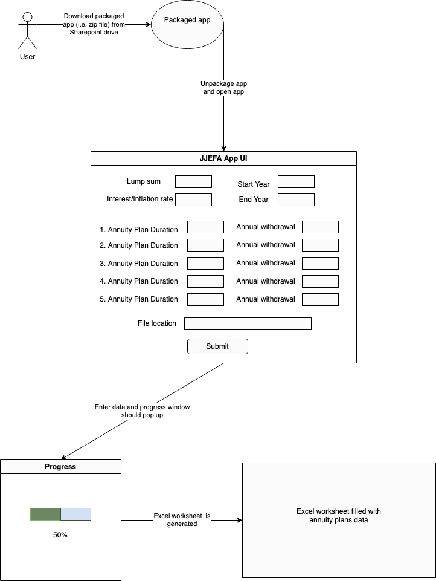

# JJ Excel Finance Application (JJEFA)

Author: Phillip Kim\
End User: JJ\
Reviewer:

## Overview

The JJEFA is a desktop application that automatically populates Excel worksheets with annuity cash flow data based on an annuity plan. The application would be capable of populating multiple columns' worth of data in the worksheet, each column containing cash flow data for each annuity plan over a certain time period. The worksheet would help a financial client have a high level overview of the cash flows over the defined time period and allow a financial advisor to better guide the client in making decisions for the client's financial future.

Each annuity plan would account for the following:

- different types of annuity plans
- client's lump sum
- annual payment/withdrawal
- interest/inflation rate

#### Technologies used:

- Java
- Sentry for bug report submissions
- Threading
- MVC architecture
- Application packaging (for both macOS and windowsOS)
- CI/CD

## User Interaction and Data Flow

1. User would have to unpackage application from their Sharepoint drive and open the application
2. For all annuity plans, user would need to input:
    - client lump sum
    - interest/inflation rate
    - start year
    - end year
3. For each annuity plan that is being added, input fields:
    - Annuity plan duration
    - annual payment/withdrawal amount
4. User can add up to 5 annuity plans' worth of data
5. Each annuity plan data will be generated in a single column and in order of what's been inputted in the application from top to bottom

## Application Features

## Architecture/Class Implementation

MVC architecture

## Testing, Monitoring, and Alerting

## CI/CD
